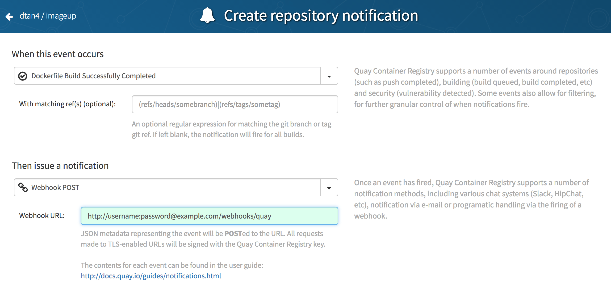

# ImageUp

[](https://travis-ci.org/dtan4/imageup)
[](https://quay.io/repository/dtan4/imageup)

Pull Docker images via HTTP webhook

Currently supported:

- [Quay Container Registry](https://quay.io/)

## Requirements

- Docker

## Installation

### Run in a Docker container

Docker image is available at [quay.io/dtan4/imageup](https://quay.io/repository/dtan4/imageup).

```bash
docker run \
  --rm \
  --name imageup \
  -p 8000:8000 \
  -v /var/run/docker.sock:/var/run/docker.sock \
  quay.io/dtan4/imageup:latest
```

### From source

```bash
go get -d github.com/dtan4/imageup
cd $GOPATH/src/github.com/dtan4/imageup
make deps
make install
```

## Usage

### 1. Launch ImageUp server

Enabling HTTP basic auth (`IMAGEUP_BASIC_AUTH_USERNAME`, `IMAGEUP_BASIC_AUTH_PASSWORD`) and pullable image whitelise (`IMAGEUP_BASIC_AUTH_WHITELIST`) is strongly recommended for security reason.

ImageUp server launches at 8000/tcp by default.
If you'd like to change th port, please specify `IMAGEUP_PORT`.

```bash
# binary on local machine
export IMAGEUP_BASIC_AUTH_USERNAME=username
export IMAGEUP_BASIC_AUTH_PASSWORD=password
export IMAGEUP_IMAGE_WHITELIST=quay.io/dtan4/imageup,nginx
imageup

# Docker container
docker run \
  --rm \
  --name imageup \
  -p 8000:8000 \
  -e IMAGEUP_BASIC_AUTH_USERNAME=username \
  -e IMAGEUP_BASIC_AUTH_PASSWORD=password \
  -e IMAGEUP_IMAGE_WHITELIST=quay.io/dtan4/imageup,nginx \
  -v /var/run/docker.sock:/var/run/docker.sock \
  quay.io/dtan4/imageup:latest
```

### 2. Configure webhook from Quay

Go to `https://quay.io/repository/<username>/<image>?tab=settings`, then click "+ Create Notification".

notification settings:

- __When this event occurs__: "Dockerfile Build Successfully Completed"
- __Then issue a notification__: "Webhook POST"
- __Webhook URL__: `http(s)://<username>:<password>@<yourdomain>/webhooks/quay`



### 3. Build image

After image build completed, the image will be pulled automatically :tada:

### Environment variables

| Key | Required | Description | Default | Example |
|-----|----------|-------------|---------|---------|
| `IMAGEUP_BASIC_AUTH_USERNAME` | | Basic auth username | | `username` |
| `IMAGEUP_BASIC_AUTH_PASSWORD` | | Basic auth password | | `password` |
| `IMAGEUP_IMAGE_WHITELIST` | | Pullable image whitelist (comma-separated) | | `quay.io/dtan4/imageup,nginx` |
| `IMAGEUP_PORT` | | HTTP server port | `8000` | `8123` |

## Author

Daisuke Fujita ([@dtan4](https://github.com/dtan4))

## License

[](LICENSE)
